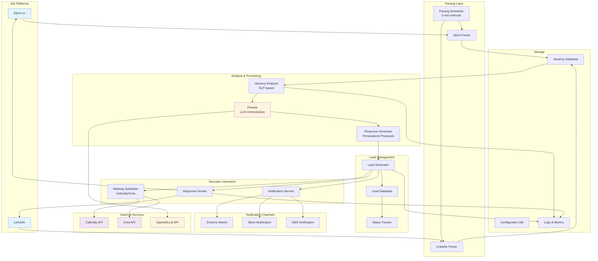
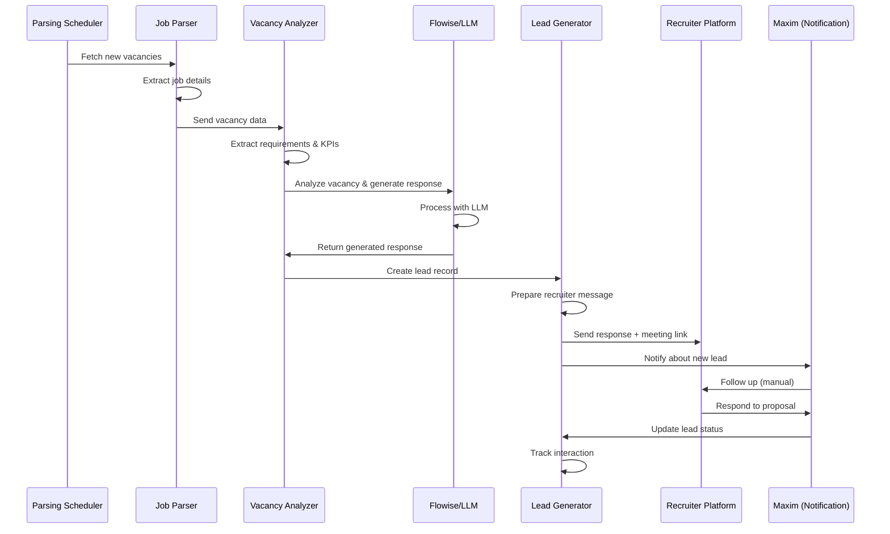

# Job Application Agent - Architecture Diagram

## System Architecture Overview

## Data Flow Sequence

## Component Details

### 1. Parsing Layer
- **Djinni Parser**: Scrapes vacancies from Djinni.co using BeautifulSoup/Selenium
- **LinkedIn Parser**: Integrates with LinkedIn API or uses authorized scraping
- **Parsing Scheduler**: Runs every 5 minutes to check for new vacancies

### 2. Analysis & Processing
- **Vacancy Analyzer**: Uses NLP to extract requirements, responsibilities, and KPIs
- **Flowise**: Visual LLM orchestration platform for creating intelligent chains
- **Response Generator**: Creates personalized proposals based on analysis

### 3. Lead Management
- **Lead Generator**: Creates and manages lead records
- **Lead Database**: Stores all lead information and history
- **Status Tracker**: Monitors lead progression through the pipeline

### 4. Recruiter Interaction
- **Response Sender**: Sends generated responses to recruiters
- **Meeting Scheduler**: Integrates with Calendly/Crea for automatic scheduling
- **Notification Service**: Alerts Maxim about new leads via multiple channels

### 5. Storage & Logging
- **Vacancy Database**: Stores parsed job vacancies
- **Configuration Database**: Manages agent settings and preferences
- **Logs & Metrics**: Tracks all actions for monitoring and optimization

## Integration Points

### External APIs
- **OpenAI API**: For LLM-based analysis and response generation
- **Calendly API**: For meeting scheduling
- **Crea API**: Alternative meeting scheduling platform
- **Slack API**: For notifications to Maxim
- **Email Service**: SMTP for email notifications

### Flowise Integration
Flowise serves as the central orchestration platform for:
- Creating reusable LLM chains for vacancy analysis
- Building self-learning agents that improve over time
- Managing complex workflows with multiple AI steps
- Providing a visual interface for non-technical configuration

## Scalability Considerations

1. **Horizontal Scaling**: Multiple parser instances can run in parallel
2. **Caching**: Redis can cache frequently accessed data
3. **Database Optimization**: PostgreSQL for production deployment
4. **Async Processing**: Use APScheduler for non-blocking operations
5. **Load Balancing**: FastAPI with multiple workers for API endpoints

## Security Considerations

1. **API Keys**: Stored in environment variables, not in code
2. **Database**: Encrypted connections with PostgreSQL
3. **Authentication**: Flowise authentication for API access
4. **Rate Limiting**: Respect platform rate limits and robots.txt
5. **Data Privacy**: Secure storage of recruiter contact information

