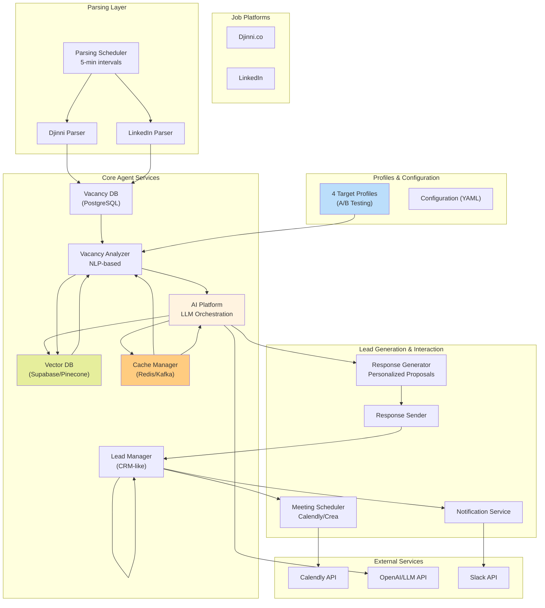
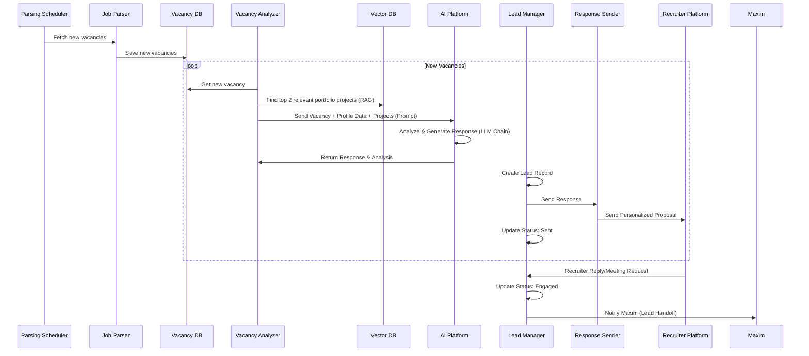

# TalentFlow Agent - Architecture Diagram

## System Architecture Overview

## Data Flow Sequence (Lead Processing)

## Component Details

### 1. Core Agent Services

- **Vacancy Analyzer**: Uses NLP to extract requirements, responsibilities, and KPIs. **Now uses VectorDB for RAG.**
- **AI Platform (Orchestration)**: Central platform for creating and managing LLM chains (chatflows). **Replaces explicit mention of Flowise.**
- **Vector DB (Supabase/Pinecone)**: Stores vectorized portfolio projects and vacancy data for **Retrieval-Augmented Generation (RAG)**.
- **Cache Manager (Redis/Kafka)**: Caches expensive LLM responses and parsing results to reduce costs and latency.
- **Lead Manager (CRM-like)**: Creates, tracks, and manages the status of all leads and interaction history.

### 2. Profiles & Configuration

- **4 Target Profiles**: Separate Git branches (`profile-swe-focused`, etc.) with unique `profile_data.json` for A/B testing and precise targeting.
- **Configuration (YAML)**: Centralized configuration for all API keys, search parameters, and chatflow IDs.

### 3. Lead Generation & Interaction

- **Response Generator**: Creates highly personalized proposals by integrating analysis from the AI Platform and relevant portfolio projects from the Vector DB.
- **Response Sender**: Handles the technical sending of the personalized response to the job platform.
- **Meeting Scheduler**: Integrates with Calendly API for automated scheduling of the "hand-off" call with Maxim.
- **Notification Service**: Alerts Maxim via Slack/Email upon lead generation or recruiter engagement.

### 4. Scalability & Optimization

- **RAG (Retrieval-Augmented Generation)**: Implemented via Vector DB to ensure responses are grounded in the user's actual portfolio data.
- **Caching**: Reduces reliance on external APIs and speeds up the process.
- **A/B Testing**: Enabled by the 4 distinct Git branches/profiles.
- **Future: Message Brokers (Kafka/RabbitMQ)**: Planned for high-volume scaling.

